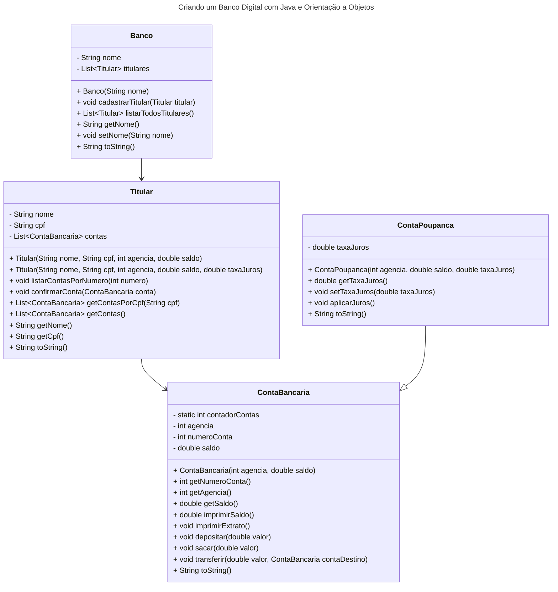

# Desafio de Projeto: Criando um Banco Digital com Java e Orientação a Objetos

* Objetivo: O objetivo deste projeto prático hands-on é reforçar o conhecimento em Programação Orientada a Objetos (POO) em Java, através da implementação de um banco digital.

* Descrição: Neste projeto, será disponibilizado no GitHub um projeto de referência que utiliza os conceitos de POO e Java para criar um banco digital. O contexto bancário será explorado para explorar os pilares da orientação a objetos, e assim, os participantes poderão reproduzir a solução e desenvolver sua capacidade de abstração.

* liste todos os clientes
* incluir lombok no codigo

#### Links úteis
[Bootcamp DIO](https://web.dio.me/lab/criando-um-banco-digital-com-java-e-orientacao-objetos/)
